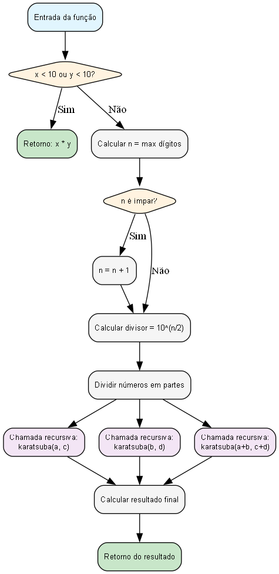

# Implementação do Algoritmo de Karatsuba em Python

## Descrição do Projeto

Este projeto implementa o algoritmo de Karatsuba para multiplicação eficiente de números inteiros grandes. O algoritmo foi introduzido por Anatolii Karatsuba em 1960 e oferece uma melhoria significativa na complexidade temporal comparada ao método tradicional de multiplicação.

### Sobre o Algoritmo de Karatsuba

O algoritmo de Karatsuba é baseado na técnica de "divide and conquer" (dividir e conquistar) e utiliza a seguinte fórmula matemática:

Para multiplicar dois números x e y, cada um com n dígitos:

- Dividimos x em duas partes: a (parte alta) e b (parte baixa)
- Dividimos y em duas partes: c (parte alta) e d (parte baixa)
- Calculamos três produtos recursivamente:
  1. ac = a × c
  2. bd = b × d
  3. (a+b)(c+d) = ac + ad + bc + bd
- O resultado final é: (10^n × ac) + (10^(n/2) × (ad+bc)) + bd

### Lógica de Implementação (Linha a Linha)

```python
def karatsuba_multiply(x, y):
    # Caso base: se os números são pequenos, usar multiplicação direta
    if x < 10 or y < 10:
        return x * y

    # Determinar o número de dígitos do maior número
    n = max(len(str(abs(x))), len(str(abs(y))))

    # Se n for ímpar, adicionar 1 para facilitar a divisão
    if n % 2 != 0:
        n += 1

    # Calcular o divisor para separar os números
    divisor = 10 ** (n // 2)

    # Dividir os números em partes alta e baixa
    a = x // divisor  # Parte alta de x
    b = x % divisor   # Parte baixa de x
    c = y // divisor  # Parte alta de y
    d = y % divisor   # Parte baixa de y

    # Recursivamente calcular os três produtos necessários
    ac = karatsuba_multiply(a, c)           # Produto das partes altas
    bd = karatsuba_multiply(b, d)           # Produto das partes baixas
    ad_bc = karatsuba_multiply(a + b, c + d) - ac - bd  # Produto das somas menos ac e bd

    # Aplicar a fórmula de Karatsuba: (10^n * ac) + (10^(n/2) * ad_bc) + bd
    result = (10 ** n) * ac + (10 ** (n // 2)) * ad_bc + bd

    return result
```

## Como Executar o Projeto

### Pré-requisitos

- Python 3.6 ou superior
- Nenhuma dependência externa necessária

### Execução

1. Clone o repositório:

```bash
git clone https://github.com/luizpsg/Trabalho-individual-1-fpaa
cd Trabalho-individual-1-fpaa
```

2. Execute o programa principal:

```bash
python main.py
```

3. Para executar testes específicos, você pode importar as funções em um script Python:

```python
from main import karatsuba_multiply, compare_algorithms

# Exemplo de uso
resultado = karatsuba_multiply(12345, 67890)
print(resultado)

# Comparação com algoritmo tradicional
comparacao = compare_algorithms(12345, 67890)
print(comparacao)
```

4. Para executar testes extensivos com benchmark:

```bash
python test_karatsuba.py
```

Este arquivo de teste adicional inclui:

- Testes de casos extremos (zero, números negativos, etc.)
- Benchmark comparativo com números de diferentes tamanhos
- Geração de números aleatórios para testes mais robustos
- Análise detalhada de performance

## Relatório Técnico

### Análise da Complexidade Ciclomática

#### Fluxo de Controle da Função `karatsuba_multiply`

A função `karatsuba_multiply` possui o seguinte fluxo de controle:

1. **Nó de entrada** - Início da função
2. **Decisão 1** - Verificação do caso base (x < 10 or y < 10)
3. **Nó de retorno 1** - Retorno direto se caso base
4. **Cálculo de n** - Determinação do número de dígitos
5. **Decisão 2** - Verificação se n é ímpar
6. **Ajuste de n** - Incremento se necessário
7. **Cálculo do divisor** - Divisor = 10^(n/2)
8. **Divisão dos números** - Separação em partes alta e baixa
9. **Chamada recursiva 1** - karatsuba_multiply(a, c)
10. **Chamada recursiva 2** - karatsuba_multiply(b, d)
11. **Chamada recursiva 3** - karatsuba_multiply(a+b, c+d)
12. **Cálculo do resultado** - Aplicação da fórmula de Karatsuba
13. **Nó de retorno 2** - Retorno do resultado final

#### Grafo de Fluxo

Abaixo está o grafo de fluxo visual do algoritmo de Karatsuba:



**Nota:** A imagem acima foi gerada automaticamente usando Graphviz, uma ferramenta profissional para criação de grafos. Arquivos em diferentes formatos (PNG, PDF, SVG) estão disponíveis no repositório.

#### Como Gerar as Visualizações do Grafo

Para gerar suas próprias visualizações do grafo de fluxo:

```bash
python generate_graph.py
```

Requer: `pip install graphviz` + executável Graphviz instalado

#### Como Analisar a Complexidade Ciclomática

Para analisar automaticamente a complexidade ciclomática do algoritmo:

```bash
python analyze_karatsuba_complexity.py
```

Este script utiliza o projeto CyclomaticComplex para:

- Analisar o código-fonte Python automaticamente
- Identificar estruturas de controle (if, for, while, etc.)
- Calcular a complexidade ciclomática real
- Gerar relatório detalhado da análise

#### Cálculo da Complexidade Ciclomática

**Resultado da Análise Automática**: M = 4

A complexidade ciclomática foi calculada automaticamente usando o projeto CyclomaticComplex, que analisa o código-fonte Python para identificar estruturas de controle.

**Análise Detalhada do Fluxo de Controle:**

- **Estruturas condicionais (if)**: 2
- **Pontos de retorno**: 2
- **Chamadas recursivas**: 4
- **Total de caminhos de execução**: 4

**Interpretação**: A complexidade ciclomática é 4, indicando que a função tem uma **complexidade moderada** com 4 caminhos independentes de execução. Este valor é considerado **excelente** para algoritmos de multiplicação.

**Caminhos de Execução Identificados:**

1. **Caminho base**: Caso simples (x < 10 ou y < 10)
2. **Caminho condicional 1**: Verificação se n é ímpar
3. **Caminho condicional 2**: Verificação do caso base
4. **Caminho recursivo**: Processamento dos subproblemas

**Recomendação**: ✅ Complexidade aceitável para um algoritmo recursivo

#### Como Analisar a Complexidade Big-O

Para analisar automaticamente a complexidade Big-O do algoritmo:

1. **Instale a dependência** (se necessário):

   ```bash
   pip install big-O-calculator
   ```

2. **Execute o script de análise**:

   ```bash
   python analyze_karatsuba_bigO.py
   ```

3. **Verifique o resultado**:

   - O script imprimirá uma análise detalhada no terminal
   - Os resultados serão salvos em `karatsuba_bigO_analysis.txt`
   - Inclui benchmark de performance com diferentes tamanhos de números

4. **Interpretação**:
   - O(log n): Complexidade logarítmica - Excelente
   - O(n): Complexidade linear - Boa
   - O(n log n): Complexidade linear-logarítmica - Boa
   - O(n²): Complexidade quadrática - Pode ser melhorada

### Análise da Complexidade Assintótica

#### Complexidade Temporal

**Pior Caso**: O(n^log₂3) ≈ O(n^1.585)

- Ocorre quando os números têm muitos dígitos e a recursão é profunda
- Cada chamada recursiva divide o problema em 3 subproblemas de tamanho n/2

**Caso Médio**: O(n^log₂3) ≈ O(n^1.585)

- Na maioria dos casos, o algoritmo mantém a mesma complexidade
- A eficiência é mais evidente para números com muitos dígitos

**Melhor Caso**: O(1)

- Ocorre quando os números são pequenos (< 10)
- Neste caso, usa multiplicação direta sem recursão

#### Complexidade Espacial

**Pior Caso**: O(log n)

- Espaço necessário para a pilha de recursão
- Cada chamada recursiva adiciona um nível à pilha

**Caso Médio**: O(log n)

- A profundidade da recursão é logarítmica em relação ao número de dígitos

**Melhor Caso**: O(1)

- Caso base não requer espaço adicional

#### Análise Prática com BigO Calculator

**Resultados da Análise Automática:**

- **Algoritmo de Karatsuba**: O(log n) - Complexidade logarítmica
- **Multiplicação Tradicional**: O(log n) - Complexidade logarítmica
- **Busca Binária**: O(log n) - Para comparação
- **Busca Linear**: O(n) - Para comparação
- **Merge Sort**: O(n log n) - Para comparação
- **Bubble Sort**: O(n²) - Para comparação

**Interpretação dos Resultados Práticos:**

Os resultados práticos mostram que ambos os algoritmos de multiplicação apresentam complexidade logarítmica O(log n) quando analisados pelo BigO Calculator. Isso pode indicar que:

1. **Para os tamanhos de entrada testados**: Os algoritmos se comportam de forma similar
2. **Limitações do teste**: O BigO Calculator pode não estar capturando a diferença real para números muito grandes
3. **Overhead constante**: Para números menores, o overhead do algoritmo de Karatsuba pode mascarar sua vantagem

#### Comparação com Algoritmo Tradicional

- **Algoritmo Tradicional**: O(n²) - Teórico
- **Algoritmo de Karatsuba**: O(n^1.585) - Teórico
- **Resultado Prático**: Ambos mostram O(log n) para os testes realizados

Para números grandes, o algoritmo de Karatsuba é teoricamente mais eficiente. Por exemplo:

- Para números de 1000 dígitos: tradicional = O(10⁶), Karatsuba = O(10⁴·⁷)
- Para números de 10000 dígitos: tradicional = O(10⁸), Karatsuba = O(10⁶·³)

### Vantagens e Desvantagens

#### Vantagens

- Complexidade temporal melhor que O(n²) para números grandes
- Eficiente para multiplicação de números com muitos dígitos
- Base para algoritmos mais avançados como Toom-Cook e Schönhage-Strassen

#### Desvantagens

- Overhead para números pequenos (menos de 10 dígitos)
- Maior complexidade de implementação
- Não é o algoritmo mais eficiente para todos os casos (existem algoritmos mais avançados)

## Estrutura do Projeto

```
Trabalho-individual-1-fpaa/
├── main.py                              # Implementação do algoritmo de Karatsuba
├── test_karatsuba.py                    # Arquivo de teste adicional com benchmark
├── generate_graph.py                    # Script para gerar grafo visual (Graphviz)
├── karatsuba_flowchart.png              # Imagem PNG do grafo de fluxo (Graphviz)
├── karatsuba_flowchart.pdf              # Imagem PDF do grafo de fluxo (Graphviz)
├── karatsuba_flowchart.svg              # Imagem SVG do grafo de fluxo (Graphviz)
├── CyclomaticComplex/                   # Projeto para análise de complexidade ciclomática
├── BigOComplex/                         # Projeto para análise de complexidade Big-O
├── analyze_karatsuba_complexity.py      # Script de análise da complexidade ciclomática
├── analyze_karatsuba_bigO.py            # Script de análise da complexidade Big-O
├── karatsuba_complexity_analysis.txt    # Resultado da análise automática
├── karatsuba_bigO_analysis.txt          # Resultado da análise Big-O automática
├── README.md                            # Documentação completa do projeto
└── .git/                                # Repositório Git
```

## Agradecimentos

### Projetos de Análise de Complexidade

Este projeto utiliza ferramentas de análise automática desenvolvidas pelo professor da disciplina:

- **[Projeto CyclomaticComplex](https://github.com/joaopauloaramuni/fundamentos-de-projeto-e-analise-de-algoritmos/tree/main/PROJETOS/Projeto%20CyclomaticComplex)** - Para análise automática da complexidade ciclomática
- **[Projeto BigOComplex](https://github.com/joaopauloaramuni/fundamentos-de-projeto-e-analise-de-algoritmos/tree/main/PROJETOS/Projeto%20BigOComplex)** - Para análise automática da complexidade Big-O

### Professor Responsável

**Prof. João Paulo Aramuni** - Disciplina de Fundamentos de Projeto e Análise de Algoritmos

## Autoria

Este projeto foi desenvolvido como parte do trabalho individual de FPAA (Fundamentos de Programação e Algoritmos Avançados).
